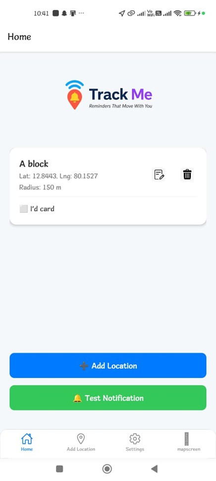
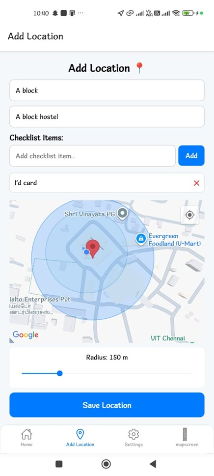
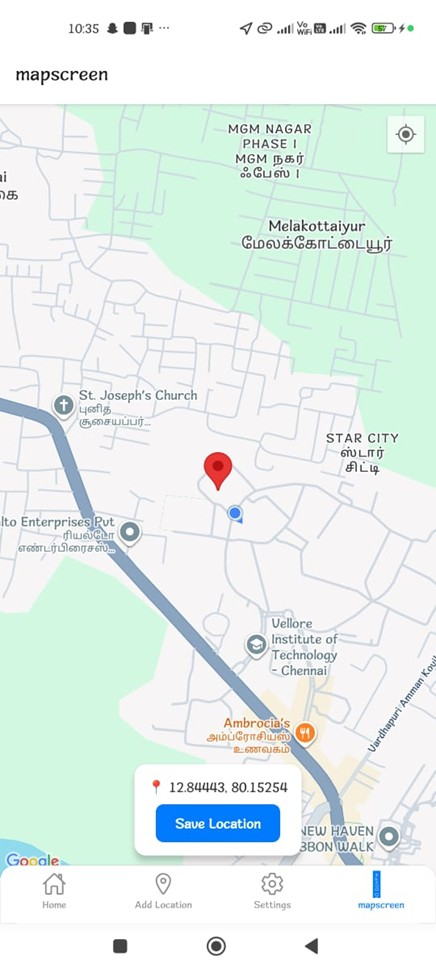
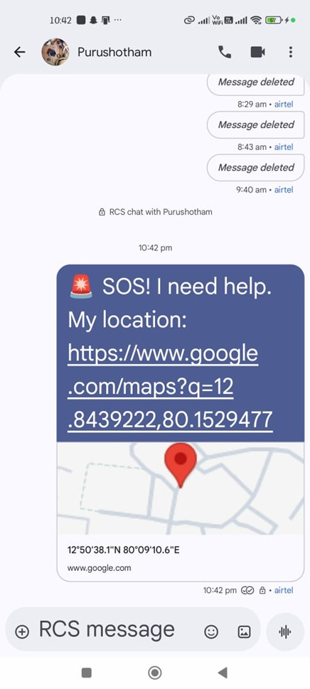
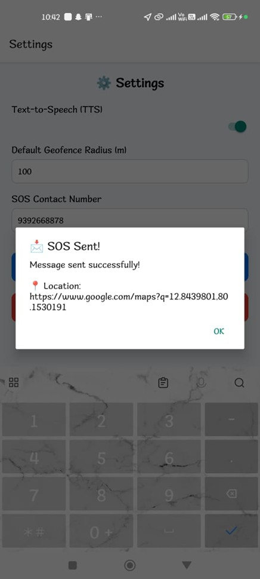
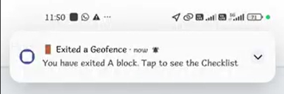
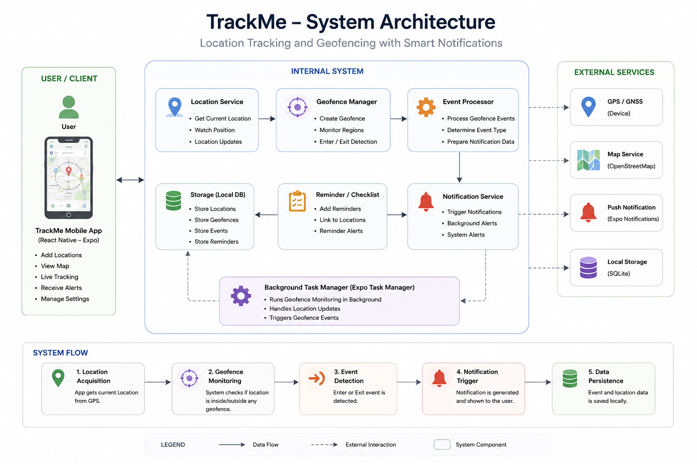

<p align="center">
  
</p>

<h1 align="center">📍 TrackMe</h1>

<p align="center">
Smart Geofencing & Location-Based Reminder App — Real-Time Tracking, Notifications, and Context-Aware Alerts
</p>

---

TrackMe is a React Native mobile application built using Expo that helps users create geofences, monitor live locations, receive background notifications, and manage location-based reminders using smart checklist integration.

The application combines geofencing, GPS tracking, notifications, SQLite storage, and real-time location monitoring into a scalable mobile system.

---

# 📑 Table of Contents

1. [Features](#-features)
2. [Screenshots](#-screenshots)
3. [Demo Videos](#-demo-videos)
4. [Architecture](#-architecture)
5. [Tech Stack](#-tech-stack)
6. [Project Structure](#-project-structure)
7. [Setup & Installation](#-setup--installation)
8. [Core Functionalities](#-core-functionalities)
9. [Future Improvements](#-future-improvements)
10. [Author](#-author)
11. [License](#-license)

---

# ✨ Features

- 📍 Real-time GPS location tracking
- 🛰️ Smart geofencing with entry & exit detection
- 🔔 Background notifications using Expo Task Manager
- 🗺️ Interactive map integration using OpenStreetMap
- 📌 Add and manage custom tracked locations
- 📋 Location-based checklist & reminder support
- ⚡ Live current location monitoring
- 💾 SQLite-based offline data persistence
- ⚙️ Configurable geofence radius and SOS settings
- 📱 Native mobile permissions & background services

---

# 📸 Screenshots

## 🏠 Home Screen



---

## 📍 Add Location Screen



---

## 🗺️ Current Location Tracking



---

## 🚨 SOS Screen



---

## 🚨 SOS Alert Popup



---

## 🔔 Notification Alert



---

# 🎥 Demo Videos

## 📱 Geofence Simulation Demo (Using Fake GPS)

[▶️ Watch Simulator Demo](https://drive.google.com/file/d/1FSY_3t-YBeRRsJvahL211obcWifvi9TK/view)

This demo demonstrates geofence triggering inside the Android simulator using a Fake GPS Location app. The device location is changed virtually to move near saved geofence regions, which triggers background notifications and geofence alerts.

- 📍 Simulated GPS location movement
- 🛰️ Geofence entry and exit detection
- 🔔 Automatic background notification triggering

---

## 🚨 Manual Geofence Triggering Demo

[▶️ Watch Manual Trigger Demo](https://drive.google.com/file/d/1Jf3vFs7SgtypiWmEjypDX4StUJY2r4DU/view)

This demo demonstrates manual geofence triggering by moving the device location from one real location to another. As the device enters or exits saved geofence regions, the application detects the movement and triggers notification alerts in real time.

- 📱 Real-time location transition monitoring
- 📍 Manual movement across saved geofence regions
- 🔔 Live geofence notification alerts

---

# 🏗️ Architecture



### Architecture Overview

- Expo Location handles GPS tracking and geofencing
- Expo Task Manager manages background geofence tasks
- React Native Maps renders interactive maps
- SQLite stores locations and checklist data locally
- Notifications alert users on geofence entry/exit events
- Modular service architecture improves scalability

---

# 🛠️ Tech Stack

| Layer | Technologies & Tools |
| :-- | :-- |
| **Frontend** | React Native, Expo, Expo Router, TypeScript |
| **Maps & GPS** | React Native Maps, Expo Location, OpenStreetMap |
| **Notifications** | Expo Notifications, Expo Task Manager |
| **Storage** | Expo SQLite, AsyncStorage |
| **Utilities** | UUID, Haversine Distance Calculations |
| **Mobile Features** | Background Tasks, Geofencing, Real-Time Tracking |

---

# 📂 Project Structure

```bash
TrackMe/
│
├── app/
│   ├── (tabs)/
│   │   ├── home.tsx
│   │   ├── add-location.tsx
│   │   ├── CurrentLocation.tsx
│   │   ├── settings.tsx
│   │   └── _layout.tsx
│   │
│   ├── modal.tsx
│   ├── index.tsx
│   └── _layout.tsx
│
├── src/
│   ├── db/
│   │   ├── database.ts
│   │   ├── models.ts
│   │   └── queries.ts
│   │
│   ├── services/
│   │   ├── api.ts
│   │   └── location.ts
│   │
│   ├── utils/
│   │   └── haversine.ts
│   │
│   └── constants.ts
│
├── tasks/
│   └── geofence.ts
│
├── assets/
│   └── images/
│
└── README.md
```

---

# ⚙️ Setup & Installation

## 1️⃣ Clone Repository

```bash
git clone https://github.com/your-username/TrackMe.git
cd TrackMe
```

---

## 2️⃣ Install Dependencies

```bash
npm install
```

---

## 3️⃣ Start Expo Development Server

```bash
npx expo start
```

---

# 📦 Main Dependencies

```bash
npm install expo-location
npm install expo-notifications
npm install expo-task-manager
npm install react-native-maps
npm install expo-sqlite
npm install react-native-uuid
npm install @react-native-async-storage/async-storage
```

---

# 🧠 Core Functionalities

## 📍 Geofencing

TrackMe allows users to:
- Create geofences with custom radius
- Detect entry and exit events
- Trigger background notifications automatically

---

## 🛰️ Real-Time Tracking

The application continuously monitors:
- Current user position
- Distance from saved locations
- Nearby tracked places

using:

```ts
watchPositionAsync()
```

and Haversine distance calculations.

---

## 🔔 Background Notifications

Expo Task Manager and Expo Notifications are used to:
- Run geofence tasks in background
- Trigger instant alerts
- Notify users when entering/exiting locations

Example:

```text
Entered geofence: Supermarket
```

---

## 💾 Offline SQLite Storage

SQLite database stores:
- Saved locations
- Geofence information
- Checklist reminders
- User data locally for offline support

---

## 📋 Smart Reminder Foundation

TrackMe supports:
- Location-linked checklist items
- Context-aware reminders
- Smart notification workflows

Example idea:

```text
Remind me to buy groceries when I reach D-Mart.
```

---

# 🚧 Future Improvements

- 📍 Live route tracking
- 📊 Travel history analytics
- ☁️ Firebase/Supabase backend integration
- 🧠 AI-powered smart reminders
- 🗣️ Text-to-Speech alerts
- 🚨 Emergency SOS live sharing
- 🌙 Enhanced dark mode support
- 📱 Push notification improvements

---

# 👨‍💻 Author

### M Purushothama Reddy

React Native Developer • Full Stack Enthusiast • Mobile Systems Developer

<p align="left">

<a href="mailto:machupalli.purushoth2023@vitstudent.ac.in" target="blank">

</a>

<a href="https://github.com/PurushothamaReddyM" target="blank">

</a>

</p>

---
